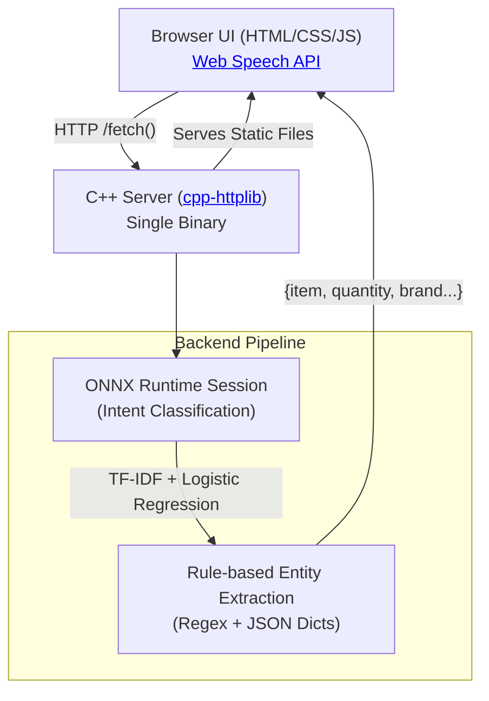

<div align="center">
  <h1>F.A.B.U.L.I.N.U.S.</h1>
  <p><strong>Fast Assistant, Built Using Logistic Inference — Native Understanding & Speech</strong></p>

  [](https://fabulinus.onrender.com/)
  <br/>
  
  [](https://isocpp.org/)
  [](https://onnxruntime.ai/)
  []()
</div>

---

## Overview

**F.A.B.U.L.I.N.U.S.** is a blazingly fast, voice-activated shopping list manager with an intelligent suggestion engine. It utilizes a **custom-trained Natural Language Processing (NLP) model** running entirely inside a native C++ backend via ONNX Runtime. 

**No cloud LLMs. No heavy Python runtimes.** Just pure, highly-optimized deterministic rules and lightning-fast inference in a single executable.

Simply speak commands like *"add 500 grams of potatoes"* or *"remove two eggs"*, and the application will instantly process the language, perform the mathematical metric conversions, and recalculate smart suggestions based on your purchase history and seasonal trends!

---

## Features

- **Voice-First "Jarvis HUD" UI**: A beautiful, dark-themed interface featuring a glowing, animated amber orb that responds to your voice in real-time.
- **Native C++ ONNX Inference**: Intent classification happens natively in C++ using a TF-IDF + Logistic Regression model. The entire NLP pipeline lives directly inside the ONNX graph.
- **Smart Metric Math**: Seamlessly handles complex metric math. Add `1 kg` of onions, remove `200 grams`, and it perfectly calculates you have `0.8 kg` left. Understands English word numbers (`one`, `two`, `a dozen`).
- **Contextual Suggestions Engine**: Recommends items dynamically based on your purchase frequency, recent behavior, time of year (seasonality), and known item substitutes.
- **Cloud Run Ready**: Ships with a Dockerfile ready to be dropped straight into Google Cloud Run or any containerized environment.

---

## Architecture



The server logic lives entirely in [`server/main.cpp`](server/main.cpp) and relies on the [ONNX Runtime](https://onnxruntime.ai/) for fast inference. 

**No Python at runtime.** Python ([`train/train.py`](train/train.py)) is used exactly once, offline, to produce `server/data/model.onnx`. The shipped server is a single C++ binary that runs instantly.

---

## Repository Layout

```text
├── index.html, css/, js/   # The frontend source code
├── server/
│   ├── main.cpp            # Core C++ Server (cpp-httplib + ONNX Runtime)
│   ├── Makefile            # Build script
│   ├── data/               # model.onnx + JSON dictionaries (metrics, items, history)
│   ├── public/             # Static frontend files served by the C++ binary
│   └── third_party/        # Vendored cpp-httplib, nlohmann/json, prebuilt ONNX Runtime
├── train/
│   ├── generate_data.py    # Generates train/data.csv (labeled examples)
│   ├── train.py            # Trains TF-IDF+LogReg, exports model.onnx (dev-only)
│   └── model.onnx          # Output models
├── .gitignore              # Ignores large binaries (like .pdb) for clean pushes
└── Dockerfile              # Cloud Run deployment config
```

---

## Running Locally

You only need `g++` (C++17) and `make`. There are no external dependencies required—ONNX Runtime, cpp-httplib, and nlohmann/json are perfectly vendored right inside the `server/third_party/` directory!

```bash
cd server
mingw32-make   # (or 'make' on Linux/Mac)
.\vsa-server.exe --port 8080
```
Then just open `http://localhost:8080` in Chrome!

> **Browser support note**: The voice input relies on the Web Speech API which has native support in Google Chrome and Microsoft Edge. It will smoothly fallback to a text box on unsupported browsers.

---

## API Endpoints

- `POST /parse {text}` → `{intent, item?, quantity?, brand?, size?, category?, price_range?}`
- `POST /log {type, item, quantity}` → records a history event (used by `/suggest`)
- `GET /suggest?list=item1,item2` → `{suggestions: [{item, reason}]}`
- `GET /search?item=&brand=&size=&price_min=&price_max=` → `{results: [{name, price, brand, size}]}`
- `GET /health` → `{status: "ok"}`
