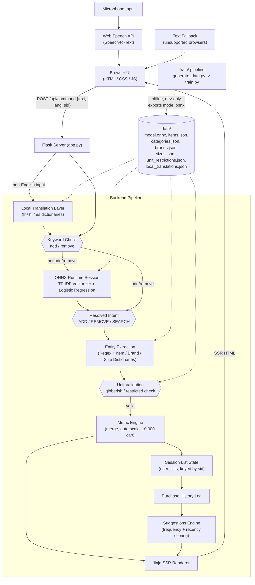

<div align="center">
  <h1>F.A.B.U.L.I.N.U.S.</h1>
  <h3>Fast Assistant, Built Using Logistic Inference — Native Understanding & Speech</h3>

  [](https://fabulinus.onrender.com/)
  <br/>

  []()
  []()
  [](https://onnxruntime.ai/)
</div>

---

## Overview

F.A.B.U.L.I.N.U.S. is a voice-activated shopping list manager with an intelligent suggestion engine. Intent classification runs locally through a TF-IDF + Logistic Regression model exported to ONNX, served inside a Flask backend that renders the UI server-side.

No cloud LLMs, no external NLP API calls at request time — classification and entity extraction both run in-process.

Speak or type a command like "add 500 grams of potatoes" or "remove two eggs," and the server classifies the intent, extracts the item, quantity, and unit, updates your list, and returns the updated HTML.

---

## Features

- **Voice-First HUD UI** — a dark-themed interface built around a tappable orb that shows idle, listening, and processing states, with a text input fallback.
- **Hybrid Intent Classification** — a fast keyword check handles the common "add" / "remove" cases directly; anything else is routed through the ONNX model, which also separates search-style queries (find, search, show, under, between) from removal-style ones (delete, clear, cancel, without).
- **Rule-Based Entity Extraction** — item, brand, and size/unit are resolved via longest-match lookups against JSON dictionaries (420 items, 17 brands, 35 sizes), independent of the ML model.
- **Quantity Parsing** — handles digits, spelled-out numbers one through ten, negatives ("minus two," "negative three"), dozens and half-dozens, and multiplied dozens ("two dozen").
- **Unit Validation** — flags nonsense units on unrecognized tokens, and enforces per-item or per-category allowed-unit lists so, for example, an item can't be added in an incompatible unit.
- **Automatic Unit Scaling** — quantities cross the 1000 threshold and convert automatically (1000 g becomes 1 kg, 1000 ml becomes 1 l, and back down again if a merge drops below 1).
- **Per-Item Quantity Cap** — merged quantities are capped at 10,000 per item, with an error message returned if the cap is hit.
- **Multi-Item Commands** — a single utterance can be split on "and" or commas into multiple parts, all sharing the intent of the first clause.
- **Multi-Language Input** — Hindi, French, and Spanish commands are mapped to English via static dictionaries before classification; UI text and downloaded lists are translated back to the selected language.
- **Session-Scoped Lists** — list state is keyed by a `sid` query parameter, so multiple users/sessions maintain independent lists on the same server.
- **Contextual Suggestions** — recommends up to 5 items not already on the list, scored from purchase frequency and recency in a seeded history log.
- **Downloadable List** — exports the current list as a categorized, translated plain-text file.

---

## How It Works

1. **Capture** — the browser records speech through the Web Speech API, or the user types into the fallback input.
2. **Translate (if needed)** — for non-English input, each word is mapped through the matching local dictionary (`fr`, `hi`, `es`) before further processing.
3. **Classify** — `add`/`remove` keywords are checked first; otherwise the text goes through the ONNX session (TF-IDF + Logistic Regression) to distinguish add, remove, and search-style intents.
4. **Extract** — regex and dictionary lookups pull out item, brand, size, and quantity; invalid or restricted units are caught here and turned into an error message rather than applied.
5. **Compute** — the metric engine merges the new quantity into any existing entry, auto-scales the unit, and applies the 10,000-unit cap.
6. **Render** — Flask renders the updated list (and, on `/api/command`, any suggestions) to HTML server-side and returns it directly to the client.
7. **Suggest** — `/api/suggest` scores items from purchase history by frequency and recency and returns up to five not already on the list.

## Example Commands

| Spoken / typed input | Result |
|---|---|
| "add 500 g of potatoes" | Adds 500 g potatoes to the list |
| "add 1 kg of potatoes" (after the above) | Merges to 1.5 kg potatoes |
| "two dozen eggs" | Adds 24 eggs |
| "remove two eggs" | Subtracts 2 from the eggs entry |
| "clear list" | Empties the current session's list |
| "find cheap rice" | Routed to the search/filter path via the ONNX model |

## Tech Stack

- **Backend**: Python, Flask, Jinja server-side rendering, gunicorn (production)
- **NLP / ML**: scikit-learn (TF-IDF + Logistic Regression) exported to ONNX, served via ONNX Runtime
- **Frontend**: HTML, CSS, vanilla JS, Web Speech API
- **Data**: Static JSON dictionaries for items, categories, brands, sizes, unit restrictions, seasonal data, substitutes, and translations
- **Deployment**: Docker (`python:3.9-slim-bookworm`), Render

## Design Notes

- Model training (`train/`) is fully separate from serving (`server/`): `model.onnx` is generated once offline and committed, so the running app depends only on ONNX Runtime, never on scikit-learn at request time.
- Entity extraction is deliberately rule-based rather than model-based — regex and dictionary lookups are more debuggable and more accurate for this narrow, structured task than an ML model would be.
- Server-side rendering keeps the client minimal: Flask returns ready-to-insert HTML fragments for the list and suggestions rather than JSON the client would need to template itself.
- The multi-language layer is a static dictionary rather than a translation API, trading broad language coverage for zero network calls and full offline reliability.

## Limitations

- Voice input requires a browser with Web Speech API support (Chrome, Edge); other browsers use the text fallback.
- The item dictionary is fixed — items outside it are not recognized, whether spoken or typed.
- Multi-language support covers Hindi, French, and Spanish; it is not a general-purpose translator.
- List and history state are held in server memory and are not persisted across restarts.

---

## Architecture



The server logic lives entirely in [`server/app.py`](server/app.py) and relies on [ONNX Runtime](https://onnxruntime.ai/) for inference.

---

## Repository Layout

```text
├── server/
│   ├── app.py                    # Flask server, SSR templates, classification & extraction logic
│   ├── generate_dict.py          # Builds offline translation dictionaries
│   ├── update_data.py            # Data maintenance script
│   ├── data/                     # model.onnx + item/category/brand/size/translation JSON
│   └── public/                   # Static frontend (index.html, css/, js/)
├── train/
│   ├── generate_data.py          # Generates train/data.csv (labeled examples)
│   ├── train.py                  # Trains TF-IDF + LogReg, exports model.onnx (dev-only)
│   ├── data.csv / vocab.json / labels.json
│   └── model.onnx                # Output model, copied into server/data
├── index.html, css/, js/         # Root-level copy of the frontend
├── requirements.txt              # flask, onnxruntime, gunicorn, numpy
└── Dockerfile                    # Render / Cloud Run deployment config
```

---

## Running Locally

Requires `python` and `pip`.

```bash
cd server
pip install -r ../requirements.txt
python app.py
```

Then open `http://localhost:8080` in Chrome.

> **Browser support:** Voice input relies on the Web Speech API, natively supported in Chrome and Edge. It falls back to a text box on unsupported browsers.

---

## API Endpoints

| Endpoint | Description |
|---|---|
| `GET /` | Serves the frontend (`index.html`) |
| `POST /api/state` | Returns the current session's list as rendered HTML |
| `POST /api/clear` | Clears the current session's list |
| `POST /api/command` | Processes a voice/text command: classifies intent, extracts entities, updates the list, returns HTML + messages |
| `GET /api/suggest` | Returns up to 5 suggested items as rendered HTML |
| `GET /api/download` | Downloads the current list as a categorized, translated `.txt` file |

All stateful endpoints accept a `sid` query parameter to scope the list to a session, and a `lang` field/parameter (e.g. `en-US`, `hi-IN`) to select translation.
