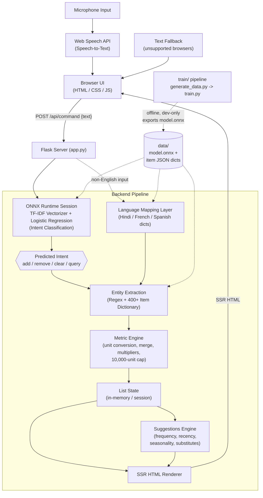

<div align="center">
  <h1>F.A.B.U.L.I.N.U.S.</h1>
  <h3>Fast Assistant, Built Using Logistic Inference — Native Understanding & Speech</h3>

  [](https://fabulinus.onrender.com/)
  <br/>

  []()
  []()
  [](https://onnxruntime.ai/)
</div>

---

## Overview

F.A.B.U.L.I.N.U.S. is a voice-activated shopping list manager with an intelligent suggestion engine. It runs a custom-trained Natural Language Processing model locally via ONNX Runtime inside a lightweight Python Flask backend.

No cloud LLMs — deterministic rules paired with fast local inference.

Speak commands like "add 500 grams of potatoes" or "remove two eggs," and the application processes the language, performs the metric conversions, and recalculates suggestions based on purchase history and seasonal trends.

---

## Features

- **Voice-First HUD UI** — a dark-themed interface with an animated orb that responds to voice input in real time.
- **Multi-Language Support** — commands work in Hindi, French, Spanish, and English. An offline, static dictionary mapping layer handles non-English input and serves localized UI lists with zero added latency and no network dependency.
- **Server-Side Rendering** — UI logic lives in Python. The server generates HTML and injects it directly into a thin client.
- **Local ONNX Inference** — intent classification runs natively via a TF-IDF + Logistic Regression model, with the full NLP pipeline inside the ONNX graph.
- **Smart Metric Engine** — handles unit conversion and accumulation (e.g., 200 g of potatoes plus a later "add 1 kg" resolves to 1.2 kg), supports multipliers like "two dozen eggs," and caps quantities at 10,000 per item.
- **400+ Item Dictionary** — pre-configured with categorized groceries across Produce, Dairy, Bakery, Pantry, Household, Personal Care, and Dry Fruits.
- **Contextual Suggestions** — recommendations driven by purchase frequency, recent activity, seasonality, and known item substitutes.

---

## How It Works

1. **Capture** — the browser records speech via the Web Speech API and converts it to text, or the user types a command directly into the fallback text box.
2. **Classify** — the text is sent to Flask, which runs it through an ONNX session holding a TF-IDF vectorizer and Logistic Regression model. This determines the intent: add, remove, clear, query, and so on.
3. **Extract** — a rule-based layer (regex plus the 400+ item dictionary) pulls out the item name, quantity, and unit from the command.
4. **Compute** — the metric engine normalizes units, merges the new quantity with any existing entry for that item, applies multiplier words like "dozen" or "pair," and enforces the 10,000-unit safety cap.
5. **Render** — Flask re-renders the relevant HTML fragment server-side and returns it directly, so the client never has to manage state or run its own templating logic.
6. **Suggest** — after each update, the suggestions engine recomputes recommendations from purchase frequency, recency, seasonality, and substitute mappings, and serves them the same way.

## Example Commands

| Spoken / typed input | Result |
|---|---|
| "add 500 grams of potatoes" | Adds 500 g potatoes to the list |
| "add 1 kg of potatoes" (after the above) | Merges to 1.2 kg potatoes |
| "two dozen eggs" | Adds 24 eggs |
| "remove two eggs" | Subtracts 2 from the eggs entry |
| "clear the list" | Empties the current list |
| "aloo add karo" (Hindi) | Adds potatoes via the offline translation layer |

## Tech Stack

- **Backend**: Python, Flask, server-side rendering
- **NLP / ML**: scikit-learn (TF-IDF + Logistic Regression) exported to ONNX, served via ONNX Runtime
- **Frontend**: HTML, CSS, vanilla JS, Web Speech API
- **Data**: Static JSON dictionaries for items, units, and multi-language mappings
- **Deployment**: Docker, Render (Cloud Run–compatible Dockerfile)

## Design Notes

- Training (`train/`) and serving (`server/`) are kept separate. The trained model is exported once to `model.onnx` and committed; the running app never depends on scikit-learn at request time, only ONNX Runtime.
- Server-side rendering was chosen over a JS framework to keep the client minimal and to make the voice interaction loop (listen, classify, respond) as low-latency as possible.
- The multi-language layer is a static dictionary rather than a translation API, trading broader language coverage for zero network calls and fully offline reliability.

## Limitations

- Voice input requires a browser with Web Speech API support (Chrome, Edge); other browsers use the text fallback.
- The item dictionary is fixed at 400+ entries — items outside it are not recognized by voice, though they can still be typed manually.
- Multi-language support covers Hindi, French, and Spanish mappings; it is not a general-purpose translator.

---

## Architecture



The server logic lives entirely in [`server/app.py`](server/app.py) and relies on [ONNX Runtime](https://onnxruntime.ai/) for inference.

---

## Repository Layout

```text
├── server/
│   ├── app.py              # Flask server + SSR + ONNX inference logic
│   ├── generate_dict.py    # Generates offline translation dictionaries
│   ├── data/                # model.onnx + 400+ item JSON dictionaries
│   └── public/               # Static frontend files (index.html, css/, js/)
├── train/
│   ├── generate_data.py    # Generates train/data.csv (labeled examples)
│   ├── train.py             # Trains TF-IDF + LogReg, exports model.onnx (dev-only)
│   └── model.onnx           # Output model
└── Dockerfile               # Cloud Run deployment config
```

---

## Running Locally

Requires `python` and `pip`.

```bash
cd server
pip install flask onnxruntime
python app.py
```

Then open `http://localhost:8080` in Chrome.

> **Browser support:** Voice input relies on the Web Speech API, natively supported in Chrome and Edge. It falls back to a text box on unsupported browsers.

---

## API Endpoints

| Endpoint | Description |
|---|---|
| `POST /api/command {text}` | Processes voice/text intent, runs unit conversions, returns full SSR HTML |
| `POST /api/state` | Returns the current list state as SSR HTML |
| `POST /api/clear` | Clears the list |
| `GET /api/suggest` | Returns smart suggestions as SSR HTML |
| `GET /api/download` | Downloads the shopping list as a formatted text file |
