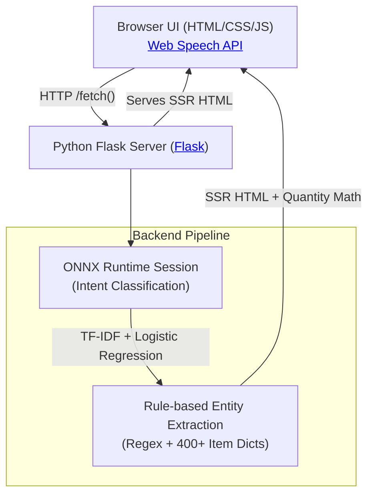

<div align="center">
  <h1>F.A.B.U.L.I.N.U.S.</h1>
  <h3>Fast Assistant, Built Using Logistic Inference — Native Understanding & Speech</h3>

  [](https://fabulinus.onrender.com/)
  <br/>
  
  []()
  []()
  [](https://onnxruntime.ai/)
</div>

---

## Overview

**F.A.B.U.L.I.N.U.S.** is a blazingly fast, voice-activated shopping list manager with an intelligent suggestion engine. It utilizes a **custom-trained Natural Language Processing (NLP) model** running locally via ONNX Runtime inside a lightweight **Python Flask** backend.

**No cloud LLMs.** Just pure, highly-optimized deterministic rules and lightning-fast local inference.

Simply speak commands like *"add 500 grams of potatoes"* or *"remove two eggs"*, and the application will instantly process the language, perform the mathematical metric conversions, and recalculate smart suggestions based on your purchase history and seasonal trends!

---

## Features

- **Voice-First "Jarvis HUD" UI**: A beautiful, dark-themed interface featuring a glowing, animated amber orb that responds to your voice in real-time.
- **Python Server-Side Rendering (SSR)**: The UI logic has been gutted from the frontend. Python handles generating the HTML and injecting it instantly into the ultra-thin client for maximum speed.
- **Local ONNX Inference**: Intent classification happens natively in Python using a TF-IDF + Logistic Regression model. The entire NLP pipeline lives directly inside the ONNX graph.
- **Smart Metric Engine**: Seamlessly handles complex metric math. Add `200 g` of potatoes, and then say *"add 1 kg of potatoes"*, and it perfectly recalculates you have `1.2 kg` (auto-converting kg to g!). 
- **Massive 400+ Item Dictionary**: Pre-configured with over 400 categorized groceries, including Produce, Dairy, Bakery, Pantry, Household, Personal Care, and Dry Fruits.
- **Contextual Suggestions Engine**: Recommends items dynamically based on your purchase frequency, recent behavior, time of year (seasonality), and known item substitutes.

---

## Architecture



The server logic lives entirely in [`server/app.py`](server/app.py) and relies on the [ONNX Runtime](https://onnxruntime.ai/) for fast inference. 

---

## Repository Layout

```text
├── server/
│   ├── app.py              # Python Flask Server + SSR + ONNX logic
│   ├── data/               # model.onnx + 400+ item JSON dictionaries
│   └── public/             # Static frontend files (index.html, css/, js/)
├── train/
│   ├── generate_data.py    # Generates train/data.csv (labeled examples)
│   ├── train.py            # Trains TF-IDF+LogReg, exports model.onnx (dev-only)
│   └── model.onnx          # Output models
└── Dockerfile              # Cloud Run deployment config
```

---

## Running Locally

You only need `python` and `pip`. 

```bash
cd server
pip install flask onnxruntime
python app.py
```
Then just open `http://localhost:8080` in Chrome!

> **Browser support note**: The voice input relies on the Web Speech API which has native support in Google Chrome and Microsoft Edge. It will smoothly fallback to a text box on unsupported browsers.

---

## API Endpoints

- `POST /api/command {text}` → Processes voice/text intent, runs unit conversions, and returns full SSR HTML
- `POST /api/state` → Returns the current list state as SSR HTML
- `POST /api/clear` → Clears the list
- `GET /api/suggest` → Returns smart suggestions as SSR HTML
- `GET /api/download` → Downloads the shopping list as a formatted text file
