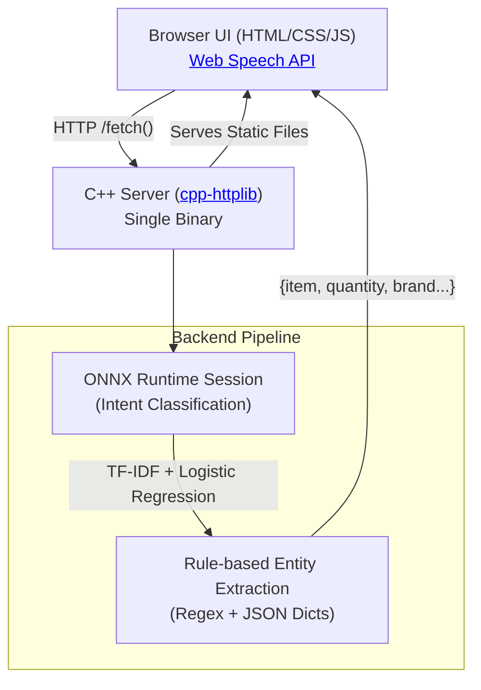

# F.A.B.U.L.I.N.U.S.

**F.A.B.U.L.I.N.U.S.** (Fast Assistant, Built Using Logistic Inference — Native Understanding & Speech) is a voice-based shopping list manager with smart suggestions. Speak (or type)
commands like "add 2 bottles of water" or "find toothpaste under $5" and the
app updates your list, runs a search, and keeps a suggestions panel fresh
based on your purchase history, the season, and substitute items.

Dark "Jarvis HUD" UI: a glowing amber orb is the primary voice control, with
idle / listening / processing animation states.

## Architecture



The server logic lives entirely in [`server/main.cpp`](server/main.cpp) and relies on the [ONNX Runtime](https://onnxruntime.ai/) for fast inference. 

**No Python at runtime.** Python ([`train/train.py`](train/train.py)) is used exactly once,
offline, to produce `server/data/model.onnx`. The shipped server is a
single C++ binary plus static data files.

**No LLM anywhere in the pipeline.** Intent classification is a small
logistic regression model; everything else is deterministic rules and
dictionary lookups.

## Repo layout

```
index.html, css/, js/          frontend source (also mirrored into server/public)
train/
  generate_data.py             generates train/data.csv (labeled examples, 3 languages)
  data.csv                     training data (ADD / REMOVE / SEARCH_ITEM / SEARCH_FILTER)
  train.py                     trains TF-IDF+LogReg, exports model.onnx (dev-only)
  model.onnx, vocab.json, labels.json   training outputs (also copied to server/data/)
server/
  main.cpp                     the C++ server (cpp-httplib + ONNX Runtime)
  Makefile                     build script
  data/                        model.onnx + JSON dictionaries the server reads at startup
  public/                      static frontend served by the C++ binary
  third_party/                 vendored cpp-httplib, nlohmann/json, prebuilt ONNX Runtime
Dockerfile
```

## Running locally

Requires: `g++` (C++17), `make`. No other build tools needed — ONNX Runtime,
cpp-httplib, and nlohmann/json are vendored under `server/third_party/`.

```bash
cd server
make
LD_LIBRARY_PATH=third_party/onnxruntime/lib ./vsa-server --port 8080
# open http://localhost:8080
```

`--data-dir` and `--static-dir` flags let you point at different data/frontend
locations; `PORT` env var overrides `--port` (used by Cloud Run).

> Note: ONNX Runtime's tokenizer op requires a locale to be installed. If you
> see a `Failed to construct locale` error, run:
> `apt-get install -y locales && locale-gen en_US.UTF-8` and export
> `LANG=en_US.UTF-8 LC_ALL=en_US.UTF-8` before starting the server (the
> Dockerfile already does this).

## API

- `POST /parse {text}` → `{intent, item?, quantity?, brand?, size?, category?, price_range?}`
- `POST /log {type, item, quantity}` → records a history event (best-effort, used by `/suggest`)
- `GET /suggest?list=item1,item2` → `{suggestions: [{item, reason}]}`
- `GET /search?item=&brand=&size=&price_min=&price_max=` → `{results: [{name, price, brand, size}]}`
- `GET /health` → `{status: "ok"}`

## Re-training the intent model (dev-only, not run by the shipped app)

```bash
pip install scikit-learn skl2onnx onnx pandas --break-system-packages
python3 train/generate_data.py   # regenerate train/data.csv if you want to edit templates
python3 train/train.py           # trains + validates + exports train/model.onnx
cp train/model.onnx train/vocab.json train/labels.json server/data/
```

## Deploying to Google Cloud Run

```bash
gcloud auth login
gcloud config set project YOUR_PROJECT_ID

gcloud builds submit --tag gcr.io/YOUR_PROJECT_ID/voice-shopping-assistant

gcloud run deploy voice-shopping-assistant \
  --image gcr.io/YOUR_PROJECT_ID/voice-shopping-assistant \
  --platform managed \
  --region us-central1 \
  --allow-unauthenticated \
  --port 8080
```

Cloud Run injects `PORT`; the server already reads it. Once deployed, the
frontend calls `/parse`, `/suggest`, etc. on the same origin, so no CORS
configuration or base-URL change is needed — the deployed URL just works.

## What's stubbed / simplified vs. a production build

- **Search catalog** (`server/data/catalog.json`) and **purchase history
  seed** (`server/data/history_seed.json`) are small hand-written mock
  datasets, not a real product database or persisted order history.
- **History persistence**: `/log` events are kept in memory for the life of
  the process (reset on restart/redeploy). Swapping in SQLite is a small,
  contained change to `HistoryStore` in `main.cpp`.
- **Training data** is template-generated (not organic user utterances), so
  the reported validation accuracy is optimistic — real-world phrasing will
  be messier. `train/generate_data.py` is meant to be edited/extended, not
  treated as final.
- **Entity dictionaries** (items/brands/sizes/categories/substitutes/seasonal)
  cover a deliberately small vocabulary (~25 items) to keep the demo fast to
  build and easy to extend; add entries to the JSON files under
  `server/data/` (and `train/generate_data.py`'s `ITEMS_*` lists, then
  retrain) to grow coverage.

## Browser support note

Voice input uses the Web Speech API (`SpeechRecognition` /
`webkitSpeechRecognition`), which has solid support in Chrome/Edge but is
unavailable or limited in Firefox and Safari. The app detects this and falls
back to the text input field automatically.
